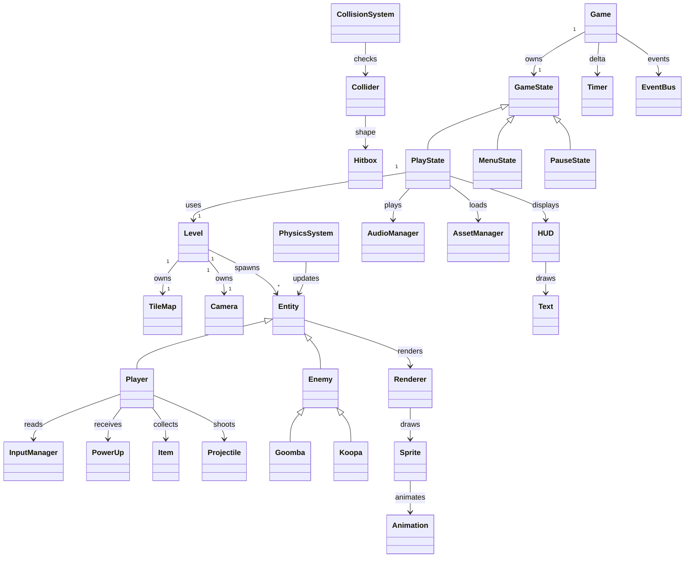

# Mario Class Diagram (Layout)

```mermaid
classDiagram
    class Game
    class GameState
    class PlayState
    class MenuState
    class PauseState

    class Level
    class TileMap
    class Camera

    class Entity
    class Player
    class Enemy
    class Goomba
    class Koopa

    class PhysicsSystem
    class CollisionSystem
    class Collider
    class Hitbox

    class InputManager

    class Renderer
    class Sprite
    class Animation

    class AudioManager
    class AssetManager

    class HUD
    class Text

    class PowerUp
    class Item
    class Projectile

    class Timer
    class EventBus

    Game "1" --> "1" GameState : owns
    GameState <|-- PlayState
    GameState <|-- MenuState
    GameState <|-- PauseState

    PlayState "1" --> "1" Level : uses
    Level "1" --> "1" TileMap : owns
    Level "1" --> "1" Camera : owns

    Level "1" --> "*" Entity : spawns
    Entity <|-- Player
    Entity <|-- Enemy
    Enemy <|-- Goomba
    Enemy <|-- Koopa

    PhysicsSystem --> Entity : updates
    CollisionSystem --> Collider : checks
    Collider --> Hitbox : shape

    Player --> InputManager : reads
    Entity --> Renderer : renders
    Renderer --> Sprite : draws
    Sprite --> Animation : animates

    PlayState --> AudioManager : plays
    PlayState --> AssetManager : loads

    PlayState --> HUD : displays
    HUD --> Text : draws

    Player --> PowerUp : receives
    Player --> Item : collects
    Player --> Projectile : shoots

    Game --> Timer : delta
    Game --> EventBus : events
```
